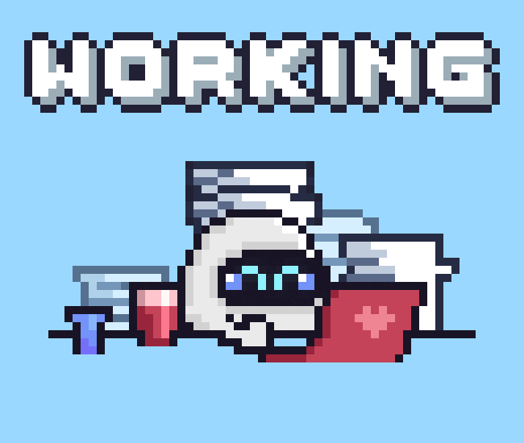

<div align="center">
  <h1 align="center"> Hi there, I'm Rijal! </h1>
  
  <p align="center">
    
  </p>
  
</div>

<p align="center">
  <em>"Math and coding on the left brain, music on the right."</em> 
   
  
</p>

<p align="center">
  <a href="https://x.com/rnovonr"></a>
  <a href="https://kaggle.com/rijal24"></a>
  <a href="https://instagram.com/ri.jalll"></a>
  <a href="mailto:rrrijal24@gmail.com"></a>
</p>

---

<div align="center">
  
</div>

###  About Me

-  I'm currently diving into **Fine-tuning** and **Agentic AI**, exploring how small tweaks can unlock big capabilities.
-  Aspiring **AI/ML Engineer** with a love for RnD and hands-on experimentation.
-  I enjoy breaking things down, testing ideas, and chasing those *“wait… it actually works?”* moments.
-  Goal: Build smarter systems and sharpen my intuition across modern AI tooling.
-  Fun fact: I try to balance logic (code/math) with creativity (music).

---

###  Tech Stack

<details open>
<summary><b> AI & Data Science</b></summary>

<p align="left">
  
  
  
  
  
  
</p>
</details>

---

###  GitHub Stats

<div align="center">
  
  
</div>

---
###  Weekly Coding Status
<!--START_SECTION:waka-->

```txt
From: 02 January 2026 - To: 09 January 2026

Markdown     3 hrs 34 mins   ██████████████▒░░░░░░░░░░   57.33 %
TeX          44 mins         ███░░░░░░░░░░░░░░░░░░░░░░   11.80 %
Text         35 mins         ██▒░░░░░░░░░░░░░░░░░░░░░░   09.41 %
Bash         28 mins         ██░░░░░░░░░░░░░░░░░░░░░░░   07.55 %
Python       28 mins         ██░░░░░░░░░░░░░░░░░░░░░░░   07.49 %
```

<!--END_SECTION:waka-->

---

###  Total Visitor

<div align="center">
  
</div>

---

<div align="center">
  
  
  ###  Let's Connect!
  
  Feel free to reach out if you want to collaborate on AI/ML projects or just talk about tech and music!
  
  
</div>